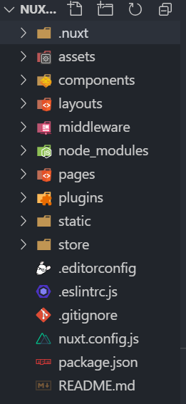

# Nuxt.js

### 一、了解Nuxt
Nuxt.js 是一个基于 Vue.js 的通用应用框架。

通过对客户端/服务端基础架构的抽象组织，Nuxt.js 主要关注的是应用的 UI渲染。

我们的目标是创建一个灵活的应用框架，你可以基于它初始化新项目的基础结构代码，或者在已有 Node.js 项目中使用 Nuxt.js。

Nuxt.js 预设了利用 Vue.js 开发服务端渲染的应用所需要的各种配置。
除此之外，我们还提供了一种命令叫：nuxt generate ，为基于 Vue.js 的应用提供生成对应的静态站点的功能。

我们相信这个命令所提供的功能，是向开发集成各种微服务（Microservices）的 Web 应用迈开的新一步。

作为框架，Nuxt.js 为 客户端/服务端 这种典型的应用架构模式提供了许多有用的特性，例如异步数据加载、中间件支持、布局支持等。


### 二、安装
1. 初始化
    vue init nuxt/starter
2. 安装过程

3. 安装依赖
   npm i

### 三、了解目录结构

```js
Nuxt.demo
├── .nuxt (启动服务器渲染的页面，基本不用管)
├── assets (静态资源目录)
├── components (Vue组件)
├── layouts  (页面布局)
├── middleware (中间件)
├── node_moudules (依赖)
├── pages (配置文件)
├── plugins (存放javascript插件)
├── static (Vuex状态)
├── store (可选)
├── .editorconfig (编辑工具)
├── .eslintrc.js (检查，)
├── .gitignore (不上传配置)
├── nuxt.config.js (配置文件重要)
├── pcakage-lock.json ()
├── package.json (包管理)
├── readme.md (说明文档))
```

### 四、配置IP地址跟端口


### 五、配置Webpack打包


### 六、书写
在pages文件夹中书写代码
1. 参数传递


2. 动态路由
格式：_文件名.vue

验证


### 七、路由动画效果
**全局加+**
1. css全局配置:
2. css:
3. vue:
    

**单独+**
1. 创建新的方法

2. 单独调用方法


### 八、默认模板与默认布局
1. 默认模板
切记在根目录创建，默认模板需要从其服务器才生效


2. 默认布局
优点不需要重启服务器，


### 九、数据仓库
[Go]](http://myjson.com/)


### 十、静态资源文件和生产静态

```js
1.生成静态文件 //默认dist文件夹
npm run generate
2.把dist安装依赖
npm install -g live-server
3.启动
live-server //默认端口8080
```
引入图片及位置
