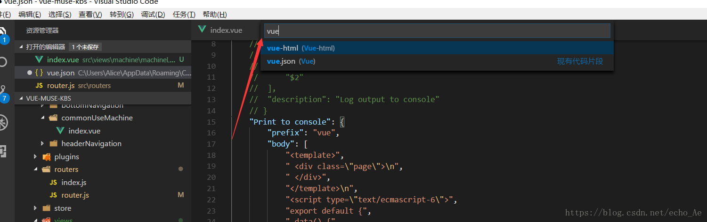
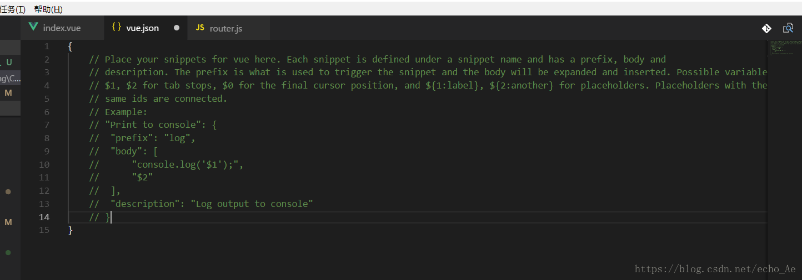
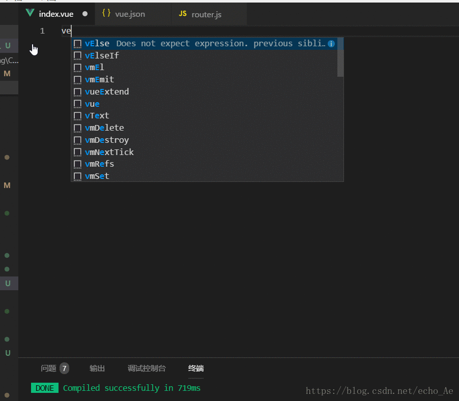

1. 文件 ==> 首选项 ==> 用户代码片段 ==> 输入  vue 然后回车



2.  添加配置，让vscode允许自定义的代码片段提示出来
```js
"Print to console": {
        "prefix": "vue",
        "body": [
			"<style>",
			"/* pageFullScreen在index.css */",
			"#xxxFullScreen {",
				"background-color: #eee;",
			"} \n",
            "</style>",
            "<template>",
            "    <div class=\"pageFullScreen\" id=\"xxxFullScreen\">\n",
            "    </div>",
            "</template>",
            "<script>",
            "export default {",
            "   data() {",
            "      return {",
			"      }",
			"   },",
			"   activated() {",
			"   }",
			"}",
			"</script>",
            "$2"
        ],
        "description": "Log output to console"
    }
```
3. 测试方法： 新建vue后缀文件，输入vue，按下tab键，OK
