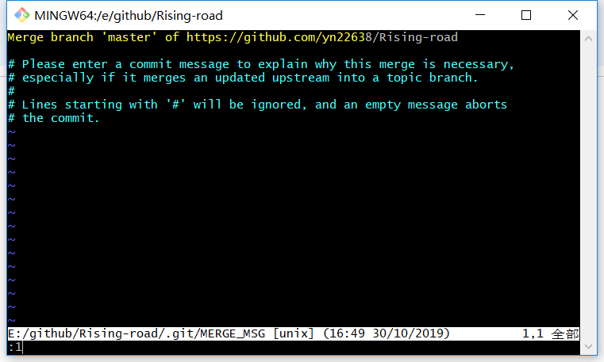

## git分支管理与操作

**上传分支**

1. 首先克隆git项目
2. 然后在项目里创建文件夹
3. git checkout -b 分支名称
4. git add .
5. git commit -m"简述"
6. git push origin 分支名称

## git创建与删除分支
1. 新建分支并切换：git chechout -b <branchName>
1. 切换主分支``git checkout master``
2. 查看已有的本地及远程分支``git branch -a``
3. 删除远程分支``git push origin --delete 分支名``
4. 删除后，再次查看分支情况``git branch -a``
5. 删除本地分支``git branch -d 分支名``

## git合并分支

1. 使用如下命令从当前分支切换到主干master上：git checkout master
2. 合并某个分支到主干master：git merge <branchName>
3. 上传push代码:git push origin

## 合并后删除分支信息

1. 使用如下命令删除分支：git branch -d <branchName>

# 报错解决方法

此图片应用``:q``解决
如果不成功那就``:q!``解决