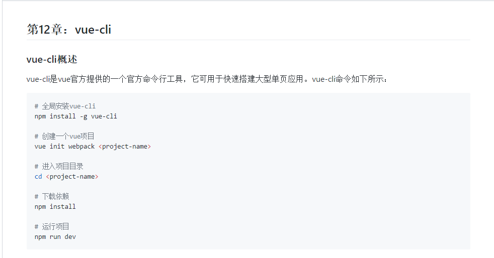
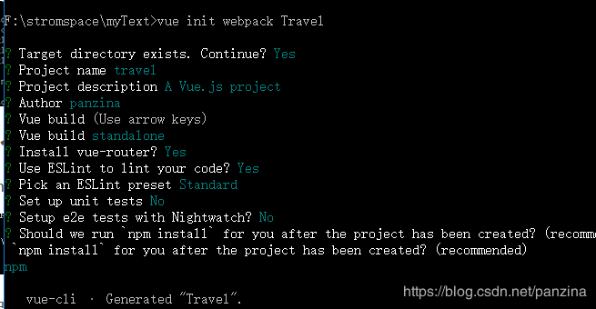
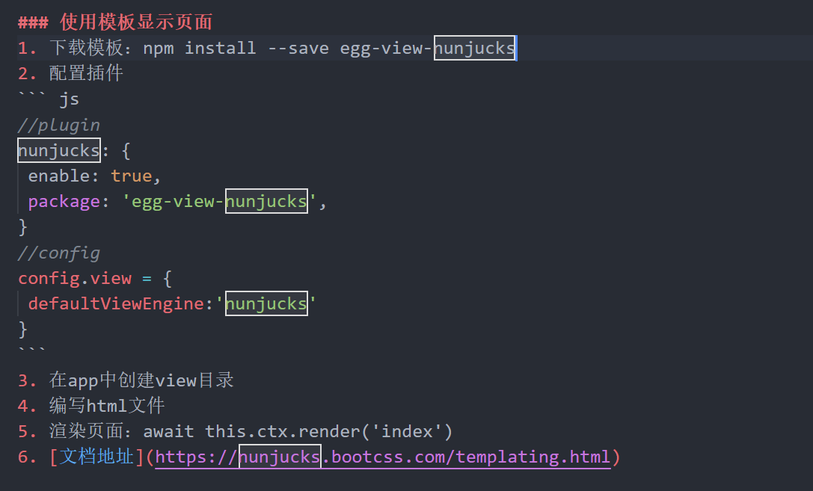

    1.安装淘宝镜像npm install -g cnpm --registry=https://registry.npm.taobao.org
      然后便可使用cnpm install -g 'name' 可进行全局安装
    
    1.1清楚cnpm缓存npm cache clean --force

    2.npm安装依赖npm install

    3.cnpm安装依赖cnpm install

    4.创建egg项目egg-init egg-example --type=simple 

    5.全局安装vue-cli： cnpm install -g vue-cli

    6.安装webpack：npm install -g webpack
    
    7.创建vue项目vue init webpack +项目名

    cnpm install vue
    cnpm install -g vue-cli
    vue init webpack new-project
    cd new-project
    cnpm install 
    cnpm run dev

    8.查找数据库用户名和密码:select * from mysql.user; 

    9.安装vue:npm install vue

  

  

#egg模板
  

### 安装数据库
  下载zip文件
  解压文件
  环境变量：MYSQL_HOME:"mysql根目录"
  生成data文件：mysqld --initialize-insecure --user=mysql
  安装服务：mysqld -install
  启动服务： net start mysql
  链接数据库：mysql -u root -p
  修改数据库密码：update mysql.user set authentication_string=password("123456") where user="root";
  退出：quit

### Git上传GitHub
  编辑区添加到暂存区：git add .
  暂存区提交到分支：git commit -m "备注"
  创建远程主机名：git remote
  同步远程仓库：git push -u origin master
  克隆项目：git clone url
  拉取项目代码: git pull

### GitHub分支
查看分支:git branch，默认只有master分支
创建分支 git branch teacher，创建teacher分支
切换分支：git checkout teacher
在自己分支上修改文件并提交。
合并分支：切换至master分支，git merge dev
本地分支推送至远程分支:git push origin feature-branch:feature-branch
远程分支拉倒本地：git checkout -b feature-branch origin/feature-branch


### seqlize安装依赖
安装egg-sequelize和mysql2：npm install --save egg-sequelize mysql2

<!-- 代码 -->
<!-- ```js``` -->

<!-- 表格 -->
<!-- |1|2|
|---|---| 
|---|---| -->
